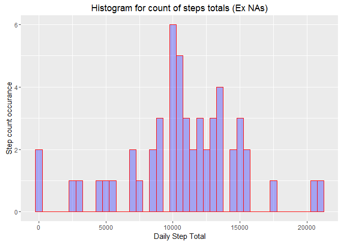
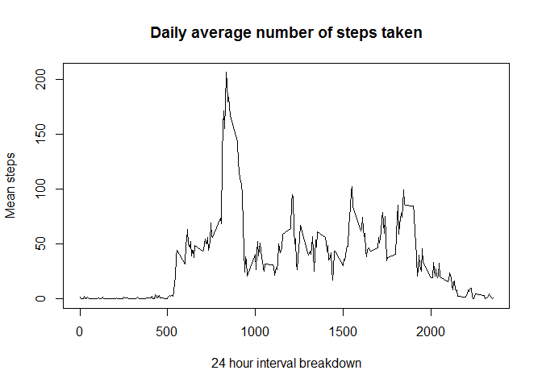
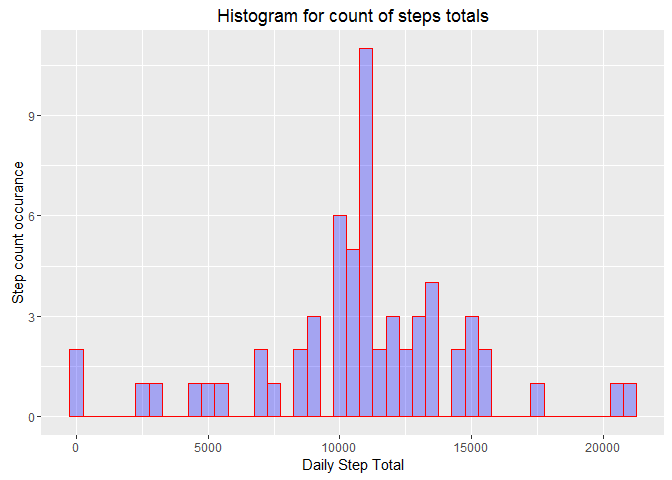
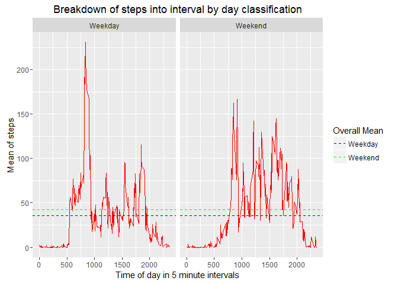

# Courseara Reproducible Research Week 2 Project
D. Lee  
12 October 2016  


## Step 1

The following loads required libraries and downloads the relevant data file. Output is hidden as there is nothing pertinant to the project objective:


```r
#function to install package if required before loading
usePackage <- function(p) 
{
  if (!is.element(p, installed.packages()[,1]))
    install.packages(p, dep = TRUE)
  suppressMessages(require(p, character.only = TRUE))
}

usePackage("data.table")
usePackage("ggplot2")
usePackage("lubridate")

zfilename <- "activity.zip"
cfilename <- "activity.csv"
## Download and unzip the dataset if doesn't exist:
if (!file.exists(cfilename)){
  fileURL <- "http://d396qusza40orc.cloudfront.net/repdata%2Fdata%2Factivity.zip"
  download.file(fileURL, zfilename, method = "libcurl")
  unzip(zfilename)
  file.remove(zfilename)
}  


dt <- fread(cfilename)
```

## Step 2

Histogram of the total number of steps taken each day:


```r
dt1 <- dt[, .(daily_total=sum(steps)), by = date]
qplot(na.omit(dt1$daily_total), geom="histogram", binwidth=500, 
      main = "Histogram for count of steps totals (Ex NAs)", 
      xlab="Daily Step Total", ylab="Step count occurance", fill=I("blue"), col=I("red"), alpha=I(.3))
```

<!-- -->

## Step 3

Mean and median number of steps taken each day:


```r
dt2 <- dt[, .(daily_mean=mean(steps), daily_median=as.double(median(steps, na.rm=TRUE))), by = date]
print(dt2)
```

```
##           date daily_mean daily_median
##  1: 2012-10-01         NA           NA
##  2: 2012-10-02  0.4375000            0
##  3: 2012-10-03 39.4166667            0
##  4: 2012-10-04 42.0694444            0
##  5: 2012-10-05 46.1597222            0
##  6: 2012-10-06 53.5416667            0
##  7: 2012-10-07 38.2465278            0
##  8: 2012-10-08         NA           NA
##  9: 2012-10-09 44.4826389            0
## 10: 2012-10-10 34.3750000            0
## 11: 2012-10-11 35.7777778            0
## 12: 2012-10-12 60.3541667            0
## 13: 2012-10-13 43.1458333            0
## 14: 2012-10-14 52.4236111            0
## 15: 2012-10-15 35.2048611            0
## 16: 2012-10-16 52.3750000            0
## 17: 2012-10-17 46.7083333            0
## 18: 2012-10-18 34.9166667            0
## 19: 2012-10-19 41.0729167            0
## 20: 2012-10-20 36.0937500            0
## 21: 2012-10-21 30.6284722            0
## 22: 2012-10-22 46.7361111            0
## 23: 2012-10-23 30.9652778            0
## 24: 2012-10-24 29.0104167            0
## 25: 2012-10-25  8.6527778            0
## 26: 2012-10-26 23.5347222            0
## 27: 2012-10-27 35.1354167            0
## 28: 2012-10-28 39.7847222            0
## 29: 2012-10-29 17.4236111            0
## 30: 2012-10-30 34.0937500            0
## 31: 2012-10-31 53.5208333            0
## 32: 2012-11-01         NA           NA
## 33: 2012-11-02 36.8055556            0
## 34: 2012-11-03 36.7048611            0
## 35: 2012-11-04         NA           NA
## 36: 2012-11-05 36.2465278            0
## 37: 2012-11-06 28.9375000            0
## 38: 2012-11-07 44.7326389            0
## 39: 2012-11-08 11.1770833            0
## 40: 2012-11-09         NA           NA
## 41: 2012-11-10         NA           NA
## 42: 2012-11-11 43.7777778            0
## 43: 2012-11-12 37.3784722            0
## 44: 2012-11-13 25.4722222            0
## 45: 2012-11-14         NA           NA
## 46: 2012-11-15  0.1423611            0
## 47: 2012-11-16 18.8923611            0
## 48: 2012-11-17 49.7881944            0
## 49: 2012-11-18 52.4652778            0
## 50: 2012-11-19 30.6979167            0
## 51: 2012-11-20 15.5277778            0
## 52: 2012-11-21 44.3993056            0
## 53: 2012-11-22 70.9270833            0
## 54: 2012-11-23 73.5902778            0
## 55: 2012-11-24 50.2708333            0
## 56: 2012-11-25 41.0902778            0
## 57: 2012-11-26 38.7569444            0
## 58: 2012-11-27 47.3819444            0
## 59: 2012-11-28 35.3576389            0
## 60: 2012-11-29 24.4687500            0
## 61: 2012-11-30         NA           NA
##           date daily_mean daily_median
```

## Step 4

Time series plot of the average number of steps taken:


```r
dt3 <- dt[, .(steps_mean=mean(steps, na.rm=TRUE)), by = interval]
plot(dt3$interval, dt3$steps_mean, type="l", ylab="Mean steps", xlab="24 hour interval breakdown",
     main="Daily average number of steps taken")
```

<!-- -->


## Step 5

The 5-minute interval that, on average, contains the maximum number of steps:


```r
dt3[order(steps_mean, decreasing = TRUE)][1]
```

```
##    interval steps_mean
## 1:      835   206.1698
```

## Step 6

Code to describe and show a strategy for imputing missing data:


```r
table(is.na(dt$steps))
```

```
## 
## FALSE  TRUE 
## 15264  2304
```

```r
dt5 <- dt[, steps := as.double(steps)]

#loop through each interval and set NAs to equal the mean for the relevant interval
for(x in 1:nrow(dt3)){
  dt5[(interval == dt3[x]$interval & is.na(steps))]$steps <- dt3[x]$steps_mean
}
```

## Step 7

Histogram of the total number of steps taken each day after missing values are imputed:


```r
dt6 <- dt5[, .(daily_total=sum(steps)), by = date]
qplot(dt6$daily_total, geom="histogram", binwidth=500, main = "Histogram for count of steps totals", 
      xlab="Daily Step Total", ylab="Step count occurance", fill = I("blue"), col = I("red"), alpha = I(.3))
```

<!-- -->

## Step 8

Panel plot comparing the average number of steps taken per 5-minute interval across weekdays and weekends:


```r
dt7 <- dt5

#new field to represent the weekend/weekday breakout
dt7$weekdayorend <- factor(ifelse(weekdays(ymd(dt7$date)) %in% c("Saturday", "Sunday"), "Weekend", "Weekday"))

#no longer need date so group up
dt7 <- dt7[, .(steps_mean=mean(steps)), by = .(interval, weekdayorend)]

ggplot(dt7, aes(x = interval, y = steps_mean)) + 
  ylab("Mean of steps") + xlab("Time of day in 5 minute intervals") +
  geom_line(colour = 'red', show.legend=FALSE) + facet_grid(. ~ weekdayorend) + 
  ggtitle("Breakdown of steps into interval by day classification") +
  geom_hline(aes(yintercept = dt7[weekdayorend == "Weekday",mean(steps_mean)] , color = "a"), linetype="dashed", show.legend=TRUE) +
  geom_hline(aes(yintercept = dt7[weekdayorend == "Weekend",mean(steps_mean)] , color = "b"), linetype="dashed", show.legend=TRUE) +
  scale_colour_manual(name = 'Overall Mean', 
                      values =c('a' = 'blue','b' = 'green'), labels = c('Weekday', 'Weekend'))
```

<!-- -->
